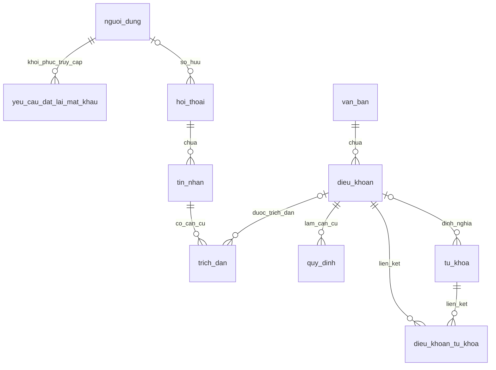

# Thiết kế MySQL cho đồ án CyberLaw

**Cập nhật 30/09/2026 — dữ liệu luật:** đã nạp bộ nguyên bản 116/2025 vào 5 bảng tri thức ở trạng thái draft. Mapping và số lượng trong [tài liệu dữ liệu](../data/01-du-lieu-luat-116.md). Schema hiện 12 bảng, 111 cột; không thêm cột trong lần nạp này. Cột `dieu_khoan.ky_hieu_diem` đổi sang `utf8mb4_0900_as_ci` để UNIQUE phân biệt điểm `d` và `đ`; migration `20260930_phan_biet_diem_d_va_dd.sql` đã được chủ dự án áp dụng và kiểm tra thật. Không chạy lại trên máy hiện tại. Các dòng mô tả chưa triển khai dưới đây thuộc lịch sử thiết kế; trạng thái backend mới nhất ở HANDOFF.

Ngày thiết kế: 27/09/2026; cập nhật đặt lại mật khẩu ngày 29/09/2026. Phạm vi: thiết kế và xuất cấu trúc cơ sở dữ liệu; chưa tích hợp Laravel, Python hoặc đăng nhập thật.

## 1. Yêu cầu cần đáp ứng

1. Đăng ký, đăng nhập, hai vai trò người dùng và quản trị viên.
2. Lưu văn bản và nội dung điều/khoản/điểm để tra cứu, mở nguyên văn.
3. Lưu keyphrase, khái niệm và dạng quy định theo yêu cầu môn học.
4. Lưu hội thoại cá nhân, câu hỏi, câu trả lời và căn cứ pháp lý.
5. Lưu yêu cầu đặt lại mật khẩu qua mã xác nhận email, có hạn dùng và trạng thái đã sử dụng.

Thiết kế dùng **11 bảng, 101 cột**, MySQL 8.0.16 trở lên, InnoDB và utf8mb4. Tên bảng và cột dùng **tiếng Việt không dấu**, viết thường và nối bằng `_`, ví dụ `nguoi_dung`, `ma_nguoi_dung`, `ngay_tao`. Tên database vẫn là `cyberlaw_search`.

Chọn trường `vai_tro` cho phân quyền; không thêm bộ bảng quyền nhiều cấp. Các giá trị ENUM như `user`, `admin` được giữ nguyên và giải thích bên dưới. Không tạo tài khoản hoặc mật khẩu mẫu trong file SQL.

## 2. Các bảng

| Bảng | Dùng để làm gì | Các trường quan trọng |
|---|---|---|
| `nguoi_dung` | Tài khoản | ma_nguoi_dung, ho_ten, thu_dien_tu duy nhất, mat_khau băm, vai_tro, trang_thai |
| `yeu_cau_dat_lai_mat_khau` | Xác nhận email và đặt lại mật khẩu | ma_yeu_cau, ma_nguoi_dung, ma_xac_nhan_bam, ma_phien_bam, so_lan_thu, ngay_tao, ngay_het_han, ngay_xac_nhan, ngay_su_dung, ngay_huy |
| `van_ban` | Thông tin văn bản luật | ma_van_ban, so_hieu, tieu_de, ngay_ban_hanh, ngay_hieu_luc, phien_ban_noi_dung, trang_thai |
| `dieu_khoan` | Đơn vị nội dung để tìm kiếm | ma_dieu_khoan, ma_van_ban, chuong, so_dieu, so_khoan, ky_hieu_diem, noi_dung, trang_nguon |
| `tu_khoa` | Cụm từ và khái niệm | ma_tu_khoa, cum_tu, bien_the, dinh_nghia, ma_dieu_khoan_dinh_nghia |
| `dieu_khoan_tu_khoa` | Liên kết nhiều cụm từ với nhiều điều khoản | ma_dieu_khoan, ma_tu_khoa; hai cột tạo thành khóa chính |
| `quy_dinh` | Đặc tả dạng luật | ma_quy_dinh, ma_dieu_khoan, loai_quy_dinh, chu_the, hanh_vi, doi_tuong, dieu_kien, ngoai_le, trich_nguyen_van |
| `hoi_thoai` | Hội thoại của một người dùng, hoặc của khách vãng lai (`ma_nguoi_dung` NULL) | ma_hoi_thoai, ma_nguoi_dung, tieu_de, ngay_tao, ngay_cap_nhat |
| `tin_nhan` | Câu hỏi và trả lời trong hội thoại | ma_tin_nhan, ma_hoi_thoai, nguoi_gui, noi_dung |
| `trich_dan` | Căn cứ của câu trả lời | ma_trich_dan, ma_tin_nhan, ma_dieu_khoan, so_hieu, phien_ban_noi_dung, vị trí điều khoản, noi_dung_trich_dan |

### Vì sao giữ bảng quy_dinh?

Đề bài yêu cầu đặc tả khái niệm và dạng luật. Định nghĩa khái niệm được gộp trong `tu_khoa`; quy định có chủ thể, hành vi, điều kiện và ngoại lệ được biểu diễn bằng `quy_dinh`. Đây là phần hỗ trợ báo cáo AI, không chỉ lưu PDF để tìm chữ.

## 3. Sơ đồ quan hệ

## 4. Quy ước nhập dữ liệu

### Tài khoản

- `nguoi_dung.vai_tro`: `user` là người dùng, `admin` là quản trị viên; mặc định `user`. Khách không cần bản ghi.
- `nguoi_dung.trang_thai`: `active` là hoạt động, `blocked` là bị khóa. Laravel phải kiểm tra trạng thái và quyền trên từng API; cột dữ liệu không tự tạo cơ chế phân quyền.
- `mat_khau` chỉ lưu giá trị băm do Laravel tạo. Mật khẩu kết nối MySQL không phải mật khẩu tài khoản ứng dụng và không đưa vào SQL.
- Laravel chuẩn hóa/trim email trước khi lưu vào `thu_dien_tu`. Tạo admin đầu tiên bằng lệnh quản trị khi triển khai backend.

### Đặt lại mật khẩu qua email

`nguoi_dung.thu_dien_tu` và `nguoi_dung.mat_khau` đã đủ để nhận diện tài khoản và lưu mật khẩu mới. Thêm một bảng `yeu_cau_dat_lai_mat_khau`, không thêm mật khẩu xác nhận vào bảng người dùng.

- `ma_xac_nhan_bam`: lưu mã OTP đã băm, không lưu mã gốc. PHP tạo mã ngẫu nhiên; bảo vệ mã ít chữ số bằng khóa bí mật ở server kết hợp hàm băm mật khẩu. Không đưa khóa này vào repository.
- `ma_phien_bam`: SHA-256 của token ngẫu nhiên đủ dài, chỉ cấp sau khi xác nhận đúng OTP. Backend dùng token này để cho phép bước nhập mật khẩu mới; không tin cờ `verified` do trình duyệt gửi lên. Token gốc chỉ tồn tại tạm thời phía client, không lưu localStorage hoặc URL.
- `so_lan_thu`: số lần nhập mã sai, tối đa 5. `ngay_het_han`: hạn dùng cả yêu cầu, đề xuất 5 phút. `ngay_xac_nhan`, `ngay_su_dung`, `ngay_huy` ghi lại từng trạng thái; null nghĩa là chưa xảy ra.
- Gửi lại mã: backend giới hạn tối thiểu 30 giây giữa các lần gửi và giới hạn thêm theo email/IP; hủy yêu cầu cũ trước khi tạo mới. Đổi email phải xác nhận lại. Trả cùng thông báo dù email có tồn tại hay không để tránh lộ danh sách tài khoản.
- Đổi mật khẩu: backend kiểm tra tài khoản, token, hạn dùng và các trạng thái trong transaction có khóa bản ghi; cập nhật `nguoi_dung.mat_khau` đã băm, đánh dấu `ngay_su_dung`, hủy các yêu cầu còn lại, vô hiệu hóa phiên đăng nhập/`ma_ghi_nho` theo cơ chế auth khi triển khai. Mã/token chỉ được dùng một lần.
- MySQL kiểm tra FK, tối đa 5 lần thử, hạn sau ngày tạo, token đi cùng thời điểm xác nhận và không cho đánh dấu sử dụng trước khi xác nhận. Việc kiểm tra thời gian hiện tại, giới hạn gửi và sử dụng một lần vẫn phải được thực hiện ở PHP. Dọn các yêu cầu hết hạn định kỳ khi có backend.
- Frontend hiện là bản dùng thử: hiển thị mã minh họa, không gửi email, không thay đổi mật khẩu hoặc ghi yêu cầu vào MySQL. Cần API PHP và dịch vụ gửi email trước khi sử dụng thật.

### Văn bản và điều khoản

- Mỗi văn bản luật có một dòng trong `van_ban`; hai bản PDF cùng số hiệu không tạo hai bộ luật độc lập.
- `van_ban.trang_thai`: `draft` là bản nháp, `published` là đã công bố, `archived` là lưu trữ. Đây là trạng thái công bố trên ứng dụng; hiệu lực pháp lý dựa vào thông tin nguồn/ngày hiệu lực đã kiểm chứng.
- `ngay_het_hieu_luc` quy ước là ngày đầu tiên văn bản không còn hiệu lực; null nghĩa là chưa ghi nhận ngày kết thúc, không tự chứng minh văn bản còn hiệu lực.
- `dieu_khoan` lưu đoạn nhỏ nhất có thể trả lời độc lập, giữ câu dẫn và ngoại lệ cần thiết. Khoản/điểm chưa chia thì để chuỗi rỗng; ví dụ `(44, '', '')`, `(2, '1', '')`, `(8, '1', 'a')` chỉ minh họa cấu trúc số, chưa phải dữ liệu nhập.
- Không lập chỉ mục trùng cả toàn điều lẫn các khoản con cùng nội dung. Mức chia được thống nhất trong bước xử lý dữ liệu.
- Các số điều/khoản dùng chuỗi ngắn để hỗ trợ trường hợp như `10a`. `thu_tu` quyết định thứ tự hiển thị.
- Khóa duy nhất gồm `ma_van_ban` + `so_dieu` + `so_khoan` + `ky_hieu_diem` để ngăn nhập trùng. Điểm có giá trị thì khoản cũng phải có.
- Khi sửa tri thức đã xuất bản, tăng `phien_ban_noi_dung`, xuất lại dữ liệu và lập lại chỉ mục. Python và Laravel cần dùng cùng phiên bản.

### Keyphrase và quy định

- `cum_tu` dùng collation có phân biệt dấu để không gộp nhầm các từ tiếng Việt khác dấu. Chuẩn hóa Unicode và trim trong ứng dụng.
- `bien_the` là mảng JSON các biến thể tìm kiếm. Đây không phải danh sách khái niệm đồng nghĩa pháp lý đã được xác nhận.
- Nếu có `dinh_nghia`, ứng dụng phải gắn căn cứ `ma_dieu_khoan_dinh_nghia` đã kiểm tra. Các cụm từ không phải định nghĩa có thể để hai trường này rỗng.
- `quy_dinh.loai_quy_dinh`: `prohibition` = nghiêm cấm, `right` = quyền, `obligation` = nghĩa vụ, `authority` = thẩm quyền, `measure` = biện pháp, `procedure` = thủ tục, `effectiveness` = hiệu lực, `other` = loại khác. Điều kiện/ngoại lệ dùng văn bản để dễ nhập và trình bày.
- `trich_nguyen_van` phải đối chiếu nguyên văn trước khi xuất bản. Một điều khoản có thể hỗ trợ nhiều quy định.
- Bản đầu duyệt và công bố cả văn bản, chưa có quy trình duyệt từng dòng riêng. Khi sửa, đưa văn bản về draft cho đến khi tri thức được kiểm tra và lập chỉ mục lại.

### Chat và căn cứ

- `tin_nhan.nguoi_gui`: `user` là người dùng, `assistant` là trợ lý AI; không liên quan vai trò admin/user của tài khoản.
- Mỗi trích dẫn lưu bản chụp nội dung, số hiệu, tiêu đề, phiên bản và vị trí điều khoản ở thời điểm trả lời. Nhờ vậy câu trả lời cũ vẫn có căn cứ dù văn bản được sửa.
- Cho phép nhiều trích đoạn từ cùng một điều khoản trong một câu trả lời; `thu_tu_trich_dan` đánh số các nguồn trong từng tin nhắn.
- Laravel kiểm tra người dùng chỉ truy cập hội thoại của mình; admin không mặc nhiên được xem chat riêng. Khi ghi citation, kiểm tra tin nhắn là của trợ lý và snapshot khớp nguồn.
- **Khách vãng lai (từ 02/10/2026)**: `hoi_thoai.ma_nguoi_dung` cho phép `NULL` — `NULL` nghĩa là hội thoại không thuộc tài khoản nào. Không tạo tài khoản giả. Danh tính khách neo theo phiên trình duyệt (danh sách `ma_hoi_thoai` trong session server-side, tối đa 20 id), nên khách chỉ mở được hội thoại do chính phiên mình tạo. Khách **không** đọc được `/api/history*`; hội thoại khách vẫn lưu và hiện trong trang thống kê admin với nhãn "Khách vãng lai" (ngoại lệ sản phẩm có chủ đích, xem `docs/security/reviews/2026-10-02-khach-vang-lai-chat.md`). Migration: `database/migrations/20261002_hoi_thoai_khach_vang_lai.sql`.
- Chỉ cập nhật `hoi_thoai.ngay_cap_nhat` khi gửi/nhận tin nhắn bằng logic ứng dụng; thời gian cập nhật ở bảng con không tự cập nhật bảng cha.

## 5. Xóa dữ liệu và tính toàn vẹn

- Xóa tài khoản sẽ xóa hội thoại, tin nhắn và trích dẫn thuộc tài khoản đó; bình thường ưu tiên khóa tài khoản thay vì xóa.
- Hội thoại khách vãng lai (`ma_nguoi_dung IS NULL`) **không** bị xóa theo tài khoản nào. Chưa có job dọn theo thời hạn — cần cân nhắc khi vận hành thật.
- Xóa hội thoại sẽ xóa tin nhắn và trích dẫn trong hội thoại.
- Văn bản có điều khoản không bị xóa trực tiếp. Nên chuyển `archived` để giữ nguồn.
- Điều khoản đang làm nguồn định nghĩa/quy định cần được xử lý các liên kết trước khi xóa. Liên kết keyphrase được dọn theo khóa ngoại.
- Nếu một điều khoản được xóa hợp lệ, trích dẫn cũ giữ bản chụp căn cứ và chuyển `ma_dieu_khoan` về null.
- Những kiểm tra liên quan quyền, xác minh nội dung pháp luật và nguồn của câu trả lời được thực hiện trong Laravel/Python.

## 6. Những phần để ngoài database ở bản đầu

- Session đăng nhập: dùng file driver của Laravel/Sanctum lúc phát triển. Chuyển sang database session sau này bằng migration nếu cần.
- Token API, hàng đợi: bổ sung khi cần triển khai. Xác minh email đã có bảng riêng (mục 10); đặt lại mật khẩu đã có luồng Laravel và bảng riêng.
- Bộ câu hỏi đánh giá AI: `data/evaluation/`.
- Embedding/chỉ mục: Python quản lý ở `data/indexes/`.
- PDF: lưu dưới dạng tệp; database giữ đường dẫn và URL nguồn.
- Nhật ký quản trị: đã thêm `nhat_ky_quan_tri` ngày 30/09/2026 (mục 9); service ghi cùng transaction và xuất log chưa triển khai.

## 7. Tệp bàn giao và cách nhập

- `database/schema.sql`: mã thiết kế có thứ tự tạo bảng dễ đọc.
- `database/cyberlaw_search.sql`: bản dump cấu trúc từ MySQL sau khi tạo và kiểm tra.
- `database/migrations/20260929_them_dat_lai_mat_khau.sql`: bổ sung bảng đặt lại mật khẩu cho database cũ. Đã áp dụng trên máy phát triển; không chạy lại hoặc chạy sau `schema.sql`.
- Desktop: bản sao cũ từ đợt bàn giao ban đầu; chưa được cập nhật trong lần bổ sung ngày 29/09/2026. Bản dump cấu trúc mới nhất nằm ở `database/cyberlaw_search.sql` trên máy phát triển và được Git bỏ qua.

Tất cả bảng được bàn giao rỗng; không có dữ liệu pháp luật mẫu chưa kiểm duyệt hoặc tài khoản có mật khẩu dựng sẵn. File dump không có lệnh DROP TABLE/DROP DATABASE.

Trên máy hiện tại đã có schema `cyberlaw_search` sau bước tạo; trong Workbench chỉ cần Refresh Schemas để xem. Trên máy mới: Server → Data Import → Import from Self-Contained File → chọn file SQL → Start Import. File có câu lệnh tạo/chọn schema. Chỉ nhập vào môi trường chưa có các bảng trùng tên; không nhập đè lên dữ liệu đang dùng.

Khi khởi tạo Laravel, viết migrations tương đương thiết kế này hoặc lập baseline cho database đã nhập. Thay migration tài khoản mặc định để tránh tạo thêm bảng `users` bên cạnh `nguoi_dung`.

### Ánh xạ tên tiếng Việt trong Laravel

- Khai báo `$table` và `$primaryKey` trong từng model; ví dụ model tài khoản dùng `nguoi_dung` và `ma_nguoi_dung`. Khai báo rõ tên khóa ngoại trong các quan hệ.
- Ánh xạ thời gian bằng `CREATED_AT = 'ngay_tao'`, `UPDATED_AT = 'ngay_cap_nhat'`. Bảng `trich_dan` chỉ có ngày tạo nên đặt `UPDATED_AT = null`; bảng liên kết `dieu_khoan_tu_khoa` không có hai cột thời gian.
- Cấu hình model xác thực dùng cột mật khẩu `mat_khau` và cột ghi nhớ `ma_ghi_nho`; truy vấn đăng nhập theo `thu_dien_tu`. Khi dùng bộ khởi tạo auth, sửa cả kiểm tra dữ liệu, thông tin xác thực và các tính năng email để khớp tên cột này.
- Các tên tiếng Việt không tự khớp quy ước mặc định của Laravel. File SQL chỉ chuẩn bị dữ liệu; phần ánh xạ và xác thực sẽ thực hiện khi viết backend.

## 8. Nguồn kỹ thuật

- MySQL foreign keys: https://dev.mysql.com/doc/refman/8.4/en/create-table-foreign-keys.html
- MySQL dump: https://dev.mysql.com/doc/refman/8.4/en/mysqldump.html

## 9. Đối chiếu frontend ↔ database (30/09/2026)

Migration `database/migrations/20260930_bo_sung_truong_khop_frontend.sql` (đã phản ánh trong `schema.sql`; **đã áp dụng lên DB dev 30/09/2026, không chạy lại**; mật khẩu MySQL không lưu trong repo). Sau migration: **11 bảng, 101 cột**.

| Thay đổi | Lý do (frontend dùng) |
|---|---|
| `nguoi_dung.lan_dang_nhap_cuoi` DATETIME NULL | Cột "lần đăng nhập cuối" ở trang quản trị; Laravel cập nhật khi đăng nhập thành công |
| `dieu_khoan.tieu_de` thêm DEFAULT '' | Form không bắt buộc tiêu đề điều khoản (UI hiện "Chưa có tiêu đề") |
| `tin_nhan.trang_thai_tra_loi`, `do_tin_cay` (0–100), `thoi_gian_xu_ly_ms` | Thẻ câu hỏi gần đây / thống kê; chỉ có ở tin nhắn assistant |
| Bảng `nhat_ky_quan_tri` (8 cột) | Audit thao tác quản trị cùng transaction (theo `docs/security/03-logging.md`) |

Không cần cột, tính bằng truy vấn: `so_hoi_thoai` = COUNT `hoi_thoai` theo người dùng; tổng quan/tăng trưởng/biểu đồ tháng/tỉ lệ loại quy định = COUNT/GROUP BY theo `ngay_tao`, `loai_quy_dinh`; trạng thái online/idle không lưu.

Quy tắc chuyển đổi API (frontend dùng chuỗi rỗng, DB dùng NULL): `co_quan_ban_hanh`, `ngay_*`, `lien_ket_nguon`, `duong_dan_tep`, `chuong`, `bien_the`, `dinh_nghia` rỗng → NULL; `so_khoan`, `ky_hieu_diem` giữ `''`. Độ dài tối đa form đã khớp DB (so_hieu 100, tieu_de 500, lien_ket_nguon 2048, chuong 100, so_dieu/khoan/diem 10).

Chưa có nguồn dữ liệu, giữ là dữ liệu mẫu UI (không lưu DB): `muc_phat`, nghề nghiệp/đơn vị người hỏi, phân nhóm trích dẫn pháp lý, `category/label/summary/note` của bài mẫu ở `articles.ts` (suy ra từ `dieu_khoan`/`quy_dinh` khi làm tìm kiếm thật).

## 10. Xác minh email (30/09/2026)

`database/migrations/20260930_xac_minh_email.sql` đã được chủ dự án chạy trong Workbench, sau đó đối chiếu chỉ đọc. Schema hiện có **12 bảng, 111 cột**; `schema.sql` đã đồng bộ cho database mới. Không chạy lại migration trên máy này. Dump cục bộ/Desktop cũ chưa được xuất lại, không dùng làm baseline mới nhất.

| Bảng / cột | Ý nghĩa |
|---|---|
| `nguoi_dung.ngay_xac_minh_email` DATETIME NULL | Thời điểm xác minh thật, UTC |
| `nguoi_dung.duoc_mien_xac_minh_email` TINYINT(1), default 0 | Giữ quyền truy cập tài khoản cũ hoặc do CLI tin cậy cấp; đăng ký công khai không được tự gán |
| `yeu_cau_xac_minh_email.ma_yeu_cau` | Khóa chính |
| `ma_nguoi_dung` | FK tài khoản, ON DELETE CASCADE |
| `ma_xac_nhan_bam` | Bcrypt mã OTP; không lưu mã gốc |
| `so_lan_thu` | Số lần sai, tối đa 5 |
| `ngay_tao`, `ngay_het_han` | Thời điểm tạo và hết hạn (5 phút) |
| `ngay_su_dung`, `ngay_huy` | Tiêu thụ một lần hoặc hủy khi gửi lại |

Hai tài khoản hiện có được miễn xác minh, ngày xác minh vẫn NULL. Tài khoản đăng ký mới phải xác minh trước khi đăng nhập. Dùng session phía server để gắn yêu cầu với đúng tài khoản; transaction khóa tài khoản trước yêu cầu xác minh. Xem [luồng và kiểm thử](../backend/03-xac-minh-email.md).
